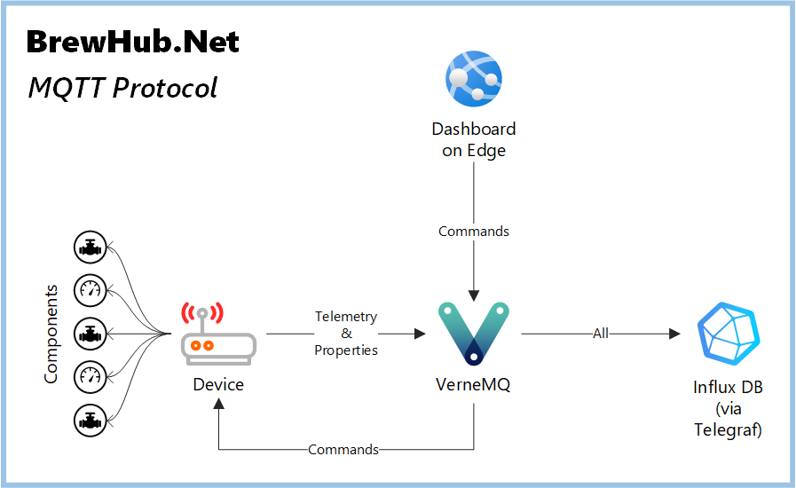

# BrewHub.Net: Multi-stack IoT Architecture

BrewHub.Net is an IoT reference architecture using .NET-based device software, InfluxDB and Grafana on a multi-node edge cluster, connected to Azure Services on the backend, with a Vue.JS dashboard for user monitoring and control.

More details: [BrewHub.Edge](https://github.com/jcoliz/BrewHub.Edge)



## What's Here: MQTT protocol definition and construction 

The BrewHub.Net protocol is 100% [IoT Plug and Play compatible](https://learn.microsoft.com/en-us/azure/iot-develop/overview-iot-plug-and-play), while taking inspiration from [Eclipse Sparkplug](https://sparkplug.eclipse.org/). Familiarity with those standards will be helpful in understanding this protocol.

### Devices & Components

The fundamental building blocks of the protocol are the physical units generating data. In BrewHub.Net, we know these as 'devices' and 'components'.

* **Devices** run software on a CPU/MCU, with identity on the network. e.g. a Raspberry Pi or Espressif ESP32
* **Components** are single-purpose dedicated sensors or actuators, connected to devices. e.g. an environmental sensor

### Models

Every device and component has a pre-defined digital twin model using the DTDL. This model specifies all details about the metrics on each device or component, and which components connect to a given device.

### Metrics

Device and component models specify the 'metrics' that the underlying software or hardware produces. BrewHub.Net uses the term 'metrics' to include all the items listed in a model. These are conceptually subdivided into:

* **Telemetry**. High-volume, often-changing, measurements produced. Always must be aggregated when viewed.
* **Properties**. Current-state information about the unit. These are usually not aggregated for display; instead, the most recent value is the relevant visualization.
* **Commands**. Instructions to the device or component on action it should take, e.g. reboot the device, or provide a history report.

Properties can be further divided into read-only and writable properties. Importantly, the state of writable properties is owned by the upstream system, not the device. If a system administrator sets a writable property, the device is expected to comply, and submit a property update when the change has been successfully applied.

### MQTT Topic

We use the MQTT protocol for communication to and from devices. The BrewHub.Net architecture includes a standard MQTT broker present on the network.

The MQTT topic is structured this way: 

```
{protocol};{version}/{site}/{message type}/{device}[/{component}]
```

Let's consider each of those in detail

* **Protocol**: The latest protocol/version is `brewhub;2`
* **Site**: Optional marker to distinguish between physical locations within the same organization. Use `none` if there is only one site in the organization
* **Message Type**: What kind of metrics are sent in the message
* **Device**: MQTT client ID of the device sending the message
* **Component**: Name of component originating the metrics contained in the message, matching the component name in the model definition. For metrics on the device, this part is omitted.

For example:

```
brewhub;2/none/Telemetry/west-1/ambient 
```

Message types are one of the following, which indicate what sort of metrics the message contains

* **Telemetry**: Only telemetry metrics.
* **Property**: Only the current reported state of properties.
* **Command**: Instructions to the device or component. Could be commands, or could be writable properties.

### Message Payload

Messages sent over MQTT have a payload in JSON. Here are examples of two separate messages:

```json
{
    "Timestamp": 1685554575529,
    "Seq": 31,
    "Model": "dtmi:brewhub:prototypes:still_6_unit;1",
    "Metrics": {
        "workingSet": 397984
    }
}
```
``` json
{
    "Timestamp": 1685554575529,
    "Seq": 32,
    "Model": "dtmi:brewhub:controls:Thermostat;1",
    "Metrics": {
        "temperature": 118.18033988749895
    }
}
```

Points to note about these elements:

* **Timestamp**: unix time in milliseconds
* **Seq**: Integer message sequence since last device restart
* **Model**: The full DTMI of object represented
* **Metrics**: User-defined telemetry AND/OR properties, as defined in Model, in key/value pairs. The key matches the 'name' defined in the model, while the value matches the 'schema' defined for that metric.

### InfluxDB Schema

BrewHub.Net messages are decomposed and stored directly in InfluxDB by Telegraf. This is how the DB entry is constructed out of each message:

* **Measurement**: Model
* **Timestamp**: Timestamp
* **Tags**: Message Type, Device, Component
* **Fields**: Seq, and each metric
